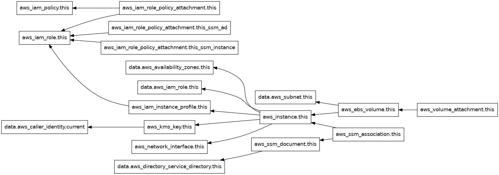

## Terraform Dependency Graph

## Terraform Documentation
## Requirements

| Name | Version |
|------|---------|
|  [terraform](#requirement\_terraform) | >= 1.3.0 |
|  [aws](#requirement\_aws) | >= 5.0.0 |

## Providers

| Name | Version |
|------|---------|
|  [aws](#provider\_aws) | 5.94.1 |

## Modules

No modules.

## Resources

| Name | Type |
|------|------|
| [aws_ebs_volume.this](https://registry.terraform.io/providers/hashicorp/aws/latest/docs/resources/ebs_volume) | resource |
| [aws_iam_instance_profile.this](https://registry.terraform.io/providers/hashicorp/aws/latest/docs/resources/iam_instance_profile) | resource |
| [aws_iam_policy.this](https://registry.terraform.io/providers/hashicorp/aws/latest/docs/resources/iam_policy) | resource |
| [aws_iam_role.this](https://registry.terraform.io/providers/hashicorp/aws/latest/docs/resources/iam_role) | resource |
| [aws_iam_role_policy_attachment.this](https://registry.terraform.io/providers/hashicorp/aws/latest/docs/resources/iam_role_policy_attachment) | resource |
| [aws_iam_role_policy_attachment.this_ssm_ad](https://registry.terraform.io/providers/hashicorp/aws/latest/docs/resources/iam_role_policy_attachment) | resource |
| [aws_iam_role_policy_attachment.this_ssm_instance](https://registry.terraform.io/providers/hashicorp/aws/latest/docs/resources/iam_role_policy_attachment) | resource |
| [aws_instance.this](https://registry.terraform.io/providers/hashicorp/aws/latest/docs/resources/instance) | resource |
| [aws_kms_key.this](https://registry.terraform.io/providers/hashicorp/aws/latest/docs/resources/kms_key) | resource |
| [aws_network_interface.this](https://registry.terraform.io/providers/hashicorp/aws/latest/docs/resources/network_interface) | resource |
| [aws_ssm_association.this](https://registry.terraform.io/providers/hashicorp/aws/latest/docs/resources/ssm_association) | resource |
| [aws_ssm_document.this](https://registry.terraform.io/providers/hashicorp/aws/latest/docs/resources/ssm_document) | resource |
| [aws_volume_attachment.this](https://registry.terraform.io/providers/hashicorp/aws/latest/docs/resources/volume_attachment) | resource |
| [aws_availability_zones.this](https://registry.terraform.io/providers/hashicorp/aws/latest/docs/data-sources/availability_zones) | data source |
| [aws_caller_identity.current](https://registry.terraform.io/providers/hashicorp/aws/latest/docs/data-sources/caller_identity) | data source |
| [aws_directory_service_directory.this](https://registry.terraform.io/providers/hashicorp/aws/latest/docs/data-sources/directory_service_directory) | data source |
| [aws_iam_role.this](https://registry.terraform.io/providers/hashicorp/aws/latest/docs/data-sources/iam_role) | data source |
| [aws_subnet.this](https://registry.terraform.io/providers/hashicorp/aws/latest/docs/data-sources/subnet) | data source |

## Inputs

| Name | Description | Type | Default | Required |
|------|-------------|------|---------|:--------:|
|  [additional\_ips](#input\_additional\_ips) | Number of additional IP addresses to assign to the EC2 instance in the provided subnet | `number` | `0` | no |
|  [ami](#input\_ami) | AMI for the EC2 instance | `string` | n/a | yes |
|  [counts](#input\_counts) | Number of EC2 instances to create | `number` | `1` | no |
|  [cpu\_options](#input\_cpu\_options) | CPU options for the EC2 instance | <pre>object({     core_count       = number     threads_per_core = number   })</pre> | `null` | no |
|  [create\_new\_role](#input\_create\_new\_role) | Set it as true if you want to create new role | `bool` | `true` | no |
|  [disk\_size](#input\_disk\_size) | Disk size for the launched instance root volume | `number` | `80` | no |
|  [domain\_id](#input\_domain\_id) | ID of the AWS Directory Services Domain to join | `string` | `""` | no |
|  [drive\_names](#input\_drive\_names) | List of Drive Name to create and attach to ec2. | `list(string)` | `[]` | no |
|  [iam\_policy\_name](#input\_iam\_policy\_name) | Custom policy name for the IAM role | `string` | `""` | no |
|  [iam\_role](#input\_iam\_role) | Enter an IAM role name that you want to attach. If you want to create a new role leave empty | `string` | `""` | no |
|  [instance\_type](#input\_instance\_type) | Type of EC2 instance | `string` | `"t2.micro"` | no |
|  [key\_name](#input\_key\_name) | Key ID used for SSH/RDP access to the EC2 instance, leave blank for none | `string` | `""` | no |
|  [name](#input\_name) | Name of the EC2 instance | `string` | n/a | yes |
|  [new\_instance\_profile\_name](#input\_new\_instance\_profile\_name) | Custom instance profile name | `string` | `""` | no |
|  [new\_role](#input\_new\_role) | Custom role name for the EC2 | `string` | `""` | no |
|  [number\_of\_interfaces](#input\_number\_of\_interfaces) | Number of interfaces to assign to the EC2 instance in the provided subnet | `number` | `1` | no |
|  [security\_group\_ids](#input\_security\_group\_ids) | List of Security Group IDs to associate to the instance (maximum five) | `list(string)` | n/a | yes |
|  [source\_dest\_check](#input\_source\_dest\_check) | Source/Destination Check for the EC2 instance | `bool` | `true` | no |
|  [subnet\_id](#input\_subnet\_id) | Subnet ID for the EC2 instance | `string` | n/a | yes |
|  [tags](#input\_tags) | Tags for the EC2 instance | `map(any)` | n/a | yes |
|  [user\_data](#input\_user\_data) | User data for the EC2 instance | `string` | n/a | yes |

## Outputs

| Name | Description |
|------|-------------|
|  [drive\_name](#output\_drive\_name) | Name of Additional EBS drives to be  created. |
|  [ec2\_instance\_arn](#output\_ec2\_instance\_arn) | String, EC2 instance ARN if created |
|  [ec2\_instance\_id](#output\_ec2\_instance\_id) | List, EC2 Instance IDs |
|  [existing\_iam\_role\_arn](#output\_existing\_iam\_role\_arn) | String, existing IAM role ARN |
|  [instance\_names](#output\_instance\_names) | List, instance names |
|  [kms\_key\_arn](#output\_kms\_key\_arn) | String, ARN of the KMS key used for encrypting the root volume |
|  [kms\_key\_id](#output\_kms\_key\_id) | String, ID of the KMS key used for encryption the root volume |
|  [new\_iam\_role\_arn](#output\_new\_iam\_role\_arn) | String, new IAM role ARN if created |
|  [private\_ip](#output\_private\_ip) | List, primary private IPs of the instances |
|  [private\_network\_interface\_ids](#output\_private\_network\_interface\_ids) | List, IDs of the private network interfaces |
|  [private\_network\_interfaces\_arns](#output\_private\_network\_interfaces\_arns) | List, ARNs of the private network interfaces |
|  [private\_network\_interfaces\_ips](#output\_private\_network\_interfaces\_ips) | List, private IP addresses for the instances |
